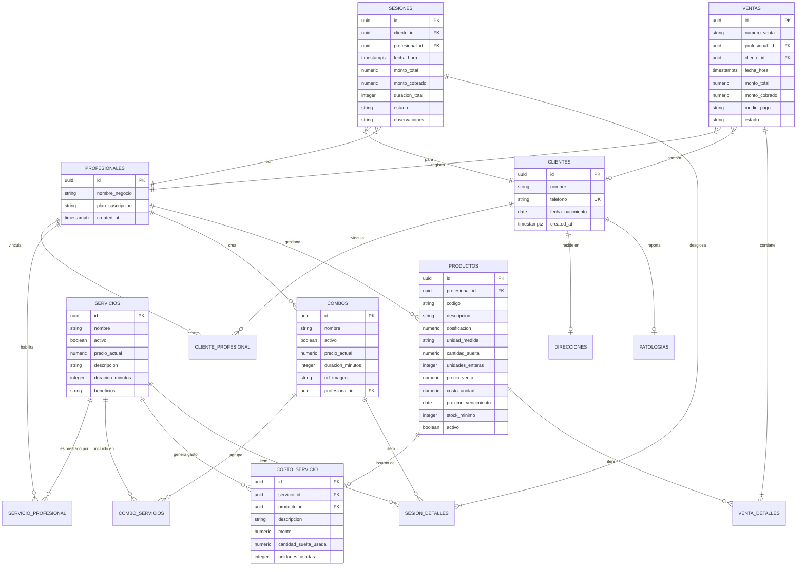

# 💆‍♀️ Sistema de Gestión para Estética y Masoterapia (PWA)

Aplicación Web Progresiva (PWA) diseñada para la gestión integral de centros de estética, masajes y terapeutas independientes. Arquitectura Multi-Tenant (SaaS) optimizada para uso offline, control de insumos y rápida carga.

## 🚀 Stack Tecnológico

* **Base de Datos & Backend:** PostgreSQL (Supabase)
* **Autenticación:** Supabase Auth
* **Frontend:** React (Configurado como PWA)
* **Estilos:** Tailwind CSS
* **Hosting:** Vercel / Netlify

## 🎯 Épicas y Funcionalidades Principales

1.  **Gestión Multiprofesional (Multi-Tenant):** Aislamiento de datos mediante Row Level Security (RLS). Cada profesional gestiona sus propios clientes, servicios y ventas.
2.  **Agenda y Sesiones Inteligentes:** Registro de citas con validación de disponibilidad horaria y estados (Pendiente, Cobrada, Ausente, Anulada). Permite múltiples servicios/combos por sesión.
3.  **Punto de Venta (POS) e Inventario:** Venta de productos con descuento de stock automático mediante funciones RPC. Soporta múltiples medios de pago.
4.  **Control de Insumos (Rentabilidad):** Cálculo del costo de insumos por servicio (unidades enteras o cantidad suelta/dosificada) para determinar el margen real.
5.  **Ficha Clínica:** Registro de patologías (hipertensión, diabetes, etc.) y direcciones vinculadas de forma única a cada cliente.

## 🗄️ Modelo de Dominio (Entity-Relationship)

